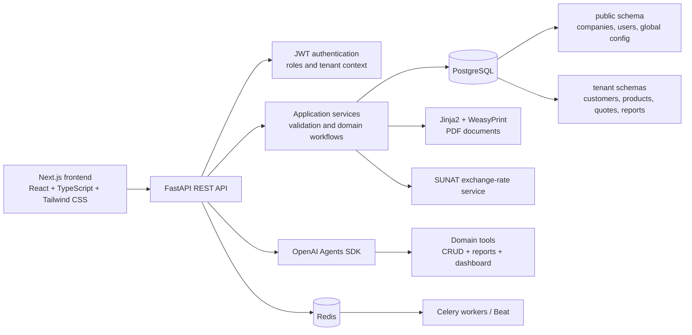

# Multi-Tenant B2B Quotation Platform

> A full-stack SaaS-oriented quotation management platform for businesses that need to manage customers, products, sales quotes, commercial reports and assisted workflows from a single workspace.


## Overview

This project is a quotation management platform designed around a multi-tenant SaaS model. It helps companies manage their commercial workflow through:

- Customer and product management.
- Quotation creation, editing, filtering and status tracking.
- PDF generation for commercial proposals.
- Executive dashboards and sales reports.
- Excel templates and bulk import for customers and products.
- Company configuration, logos and bank account information.
- JWT-based authentication and role/permission foundations.
- An experimental AI assistant that can query and operate on business data through application tools.

The current product scope is focused on **quotations and commercial intelligence**. The data model and backend contain foundations for future invoicing and SUNAT-related workflows, but electronic invoicing is not presented as a finished feature of the current frontend experience.

## Why this project

The project was built to explore the problems that appear when a simple CRUD application grows into a business-oriented SaaS product:

- How can each company keep its data isolated inside the same PostgreSQL database?
- How can sales teams manage the complete lifecycle of a quote instead of only creating records?
- How can reports turn quote history into useful commercial decisions?
- How can an AI assistant work with real application data without bypassing authentication and tenant context?
- How can the domain evolve toward invoicing without forcing the first version to become an oversized monolith?

## Current capabilities

### Quotation workflow

- Create quotations from existing customers and products.
- Apply quantities, prices, discounts, IGV and currency information.
- Support PEN and USD amounts with an exchange-rate service integration.
- Configure validity period, payment terms, delivery terms and commercial notes.
- Track quote states such as `borrador`, `enviada`, `aceptada`, `rechazada` and `convertida`.
- Edit or delete draft quotations.
- Download a formatted PDF proposal generated from a Jinja2/HTML template.
- Keep the relationship between a quotation and a future invoice document in the domain model.

### Dashboard and reporting

The dashboard is designed as an executive view of the sales pipeline and includes:

- Quotation volume and variation.
- Conversion rate.
- Revenue and average ticket in PEN or USD.
- Pending quotations that require follow-up.
- Daily quotation series.
- Top-performing products.
- Products with low conversion or lost commercial value.
- Inactive customers.
- Seller performance and conversion rates.

Dedicated reports are available for:

- Quotation performance and commercial alerts.
- Top products by quotation revenue and conversion.
- Customer segmentation, including VIP/regular classification and inactivity indicators.

### AI assistant proof of concept

The application includes an in-product chatbot powered by the OpenAI Agents SDK. The assistant is connected to a tool layer that can work with the business domain, including:

- Searching, creating and updating customers.
- Searching, creating and updating products.
- Searching, reading and updating quotations.
- Changing quotation status.
- Reading dashboard and report data.
- Filtering products by price.

The assistant follows an explicit confirmation flow before creating a quotation draft. Its context includes the authenticated user, company and tenant schema so that the assistant can operate within the current company boundary.

> This chatbot is an experimental feature for demonstrating tool calling and domain integration. It should not be treated as an autonomous production agent without additional evaluation, observability, rate limiting and security hardening.

### Bulk import

Administrators can download and upload Excel templates for:

- Customers.
- Products.

The import service validates required fields, detects duplicates inside the file and against the database, reports row-level errors and inserts valid records in batches.

### Company and account management

The backend includes flows for:

- Company onboarding and tenant provisioning.
- User accounts and roles.
- Company profile configuration.
- Company logo upload.
- Bank account management for commercial documents.
- Password reset and password change flows.
- Global and tenant-level audit records.

## Architecture



### Schema-per-tenant data isolation

The platform uses a single PostgreSQL database with a schema-per-tenant strategy:

```text
public
├── empresas
├── usuarios
├── configuracion_empresa
├── cuentas_bancarias
└── audit_global

empresa_<tenant>
├── clientes
├── productos
├── cotizaciones
├── items_cotizacion
├── facturas (domain foundation)
├── items_factura (domain foundation)
├── secuencias (domain foundation)
├── notas_comprobante (domain foundation)
└── audit_logs
```

When a company is provisioned, the backend creates its PostgreSQL schema and initializes the tenant tables. Tenant-aware dependencies set the appropriate `search_path` before running queries, while shared metadata remains in the `public` schema.

This approach provides logical isolation between companies while keeping the operational model simpler than maintaining a separate database per customer.

## Technology stack

### Backend

- Python 3.11.
- FastAPI.
- Pydantic Settings and Pydantic schemas.
- SQLAlchemy 2.0 with asynchronous sessions.
- PostgreSQL and `asyncpg`.
- JWT authentication with `python-jose`.
- Password hashing with `bcrypt` through Passlib.
- Jinja2 and WeasyPrint for server-side PDF generation.
- `openpyxl` for Excel templates and bulk imports.
- Redis, Celery and Flower for background-task infrastructure.
- OpenAI Agents SDK for the experimental assistant.

### Frontend

- Next.js 16 with the App Router.
- React 19.
- TypeScript.
- Tailwind CSS.
- Zustand for client-side state.
- React Hook Form and Zod for form handling and validation.
- Recharts for dashboard visualizations.
- Typed fetch-based API integration.
- Lucide React for interface icons.

### Infrastructure and delivery

- Docker and Docker Compose.
- PostgreSQL 16 in the root Compose stack.
- Redis 7.
- Separate backend and frontend containers.
- FastAPI OpenAPI documentation.

## Repository structure

```text
.
├── backend/
│   ├── app/
│   │   ├── api/              # HTTP route modules by business area
│   │   ├── ai/               # Agent, context and tool definitions
│   │   ├── core/             # Settings, security, dependencies and roles
│   │   ├── db/               # Database bootstrap scripts
│   │   ├── models/            # Shared and tenant SQLAlchemy models
│   │   ├── schemas/           # Pydantic request/response schemas
│   │   ├── services/          # Application and domain-oriented services
│   │   ├── tasks/             # Celery configuration and tasks
│   │   └── templates/         # HTML templates used for PDFs
│   ├── Dockerfile
│   └── requirements.txt
├── frontend/
│   ├── app/                   # Next.js routes and dashboard screens
│   ├── components/            # Shared UI, layout and chatbot components
│   ├── context/               # Authentication context
│   ├── hooks/                 # Reusable client hooks
│   ├── lib/                   # API client and shared utilities
│   ├── services/              # Typed frontend API services
│   ├── types/                 # Domain and API TypeScript types
│   └── Dockerfile
├── scripts/                   # Project scripts
├── templates/                 # Shared document styles
├── docker-compose.yml
└── .env.example
```

## Getting started with Docker

### Prerequisites

- Docker Desktop with Docker Compose.
- Git.
- An OpenAI API key if you want to use the chatbot.

### 1. Clone the repository

```bash
git clone https://github.com/fabiovallejo/cotizador.git
cd cotizador
```

### 2. Configure the environment

Copy the example file and review the values before starting the stack:

```bash
cp .env.example .env
```

For PowerShell:

```powershell
Copy-Item .env.example .env
```

For the AI assistant, provide an `OPENAI_API_KEY` to the backend environment. Keep secrets out of Git and never use the development defaults in a public deployment.

The backend and frontend Docker contexts exclude local `.env` files, dependency folders, build output, certificates, and private keys. The frontend receives `NEXT_PUBLIC_API_URL` as a public build argument; set it in the root `.env` when the browser must reach an API host other than `http://localhost:8000/api`.

At runtime, Compose loads `backend/.env` when present and lets the root `.env` override it. These files are runtime configuration only and are excluded from the Docker images.

The backend uses SQLAlchemy's asynchronous engine. If you provide `DATABASE_URL` manually, use the `postgresql+asyncpg://...` scheme rather than the synchronous `postgresql://...` scheme.

### 3. Start the services

```bash
docker compose up --build -d
```

Run Compose commands from the repository root (`E:\facturador-saas`). The `backend/docker-compose.yml` file is a legacy backend-only configuration and is not part of the supported local workflow.

The root Compose stack starts:

| Service | URL / purpose |
| --- | --- |
| Frontend | http://localhost:3000 |
| Backend API | http://localhost:8000 |
| OpenAPI docs | http://localhost:8000/docs |
| Health check | http://localhost:8000/health |
| PostgreSQL | localhost:5432 |
| Redis | localhost:6379 |
| Flower | http://localhost:5555 |

### 4. Initialize the database

You do not need to create a PostgreSQL database manually. The `db` service creates the database configured by `DB_NAME` when the Postgres volume is initialized. The default name is `facturacion_db`; it is not `facturacion` unless you change `DB_NAME` in the root `.env` before the first startup.

The PostgreSQL database managed by Docker is separate from any PostgreSQL or pgAdmin installation running directly on Windows. If the local PostgreSQL service is using port `5432`, stop it before starting the Docker stack, or change the host-side `DB_PORT`. Deleting a database from pgAdmin does not delete the Docker Postgres volume.

The backend does not run the schema bootstrap automatically on application startup. After the containers are healthy, run this command once:

```bash
docker compose exec backend python -c "from app.db.init_db import crear_bd_completa; crear_bd_completa()"
```

This creates the shared tables in `public`, the initial `empresa_1` tenant schema, indexes, constraints, and document sequences. The command is idempotent for the existing structures.

### 5. Create the first user

There is no demo seed in the repository. The bootstrap creates database structures and document sequences, but no companies, users, products, customers, or login credentials. The `empresa_1` schema is only a structural example.

Set `ADMIN_SECRET_KEY` in the root `.env`, then create the first company and administrator through the onboarding endpoint:

```http
POST /api/admin/onboard-company
```

The request body must include the company information and the credentials that will be used for login. The following is an example only; these credentials are not pre-created:

```json
{
  "ruc": "20123456789",
  "razon_social": "Empresa Demo S.A.C.",
  "direccion": "Av. Principal 123",
  "owner_email": "admin@example.com",
  "owner_nombre": "Admin",
  "owner_apellido": "Demo",
  "owner_password": "ChangeMe123"
}
```

Send it with the configured admin secret:

```bash
curl -X POST http://localhost:8000/api/admin/onboard-company \
  -H "Content-Type: application/json" \
  -H "x-admin-secret: YOUR_ADMIN_SECRET_KEY" \
  -d @company.json
```

The endpoint creates the company and administrator, then provisions the tenant schema in the background. Use the `owner_email` and `owner_password` supplied in the request to log in at http://localhost:3000/login.

## API modules

The FastAPI application is organized by business capability:

| Module | Responsibility |
| --- | --- |
| `/api/auth` | Login, current user, password reset and JWT sessions |
| `/api/admin` | Company and tenant onboarding |
| `/api/empresa` | Company configuration, users, profile and logo |
| `/api/clientes` | Customer CRUD and search |
| `/api/productos` | Product/service CRUD and search |
| `/api/cotizaciones` | Quote lifecycle, filters, PDF and conversion foundation |
| `/api/reportes` | Quote, customer, product and executive dashboard reports |
| `/api/importacion` | Excel templates and bulk imports |
| `/api/chat` | Authenticated AI assistant endpoint |
| `/api/facturas` | Backend invoicing foundation and document operations |
| `/api/utils` | Exchange rates and seller lookups |

## Design decisions worth highlighting

### Tenant isolation at the database level

Instead of relying only on a `tenant_id` column in every table, tenant business data is placed in an independent PostgreSQL schema. The application keeps global identity and company metadata in `public`, then switches the connection search path for tenant operations.

### Service-oriented backend organization

Routes are kept thin and delegate business operations to services. Pydantic schemas define API contracts, SQLAlchemy models define persistence, and the AI tools use the same application capabilities instead of embedding business logic in the chat UI.

### Commercial documents as generated artifacts

Quotation PDFs are rendered from HTML templates with company branding, customer data, line items, taxes, totals, payment terms, bank accounts and conditions. This keeps the presentation layer separate from the quotation domain model.

### Reports designed around decisions

The reporting layer is not limited to raw lists. It calculates conversion, lost commercial value, average ticket, inactive customers, product performance and seller performance so the dashboard can support follow-up and sales decisions.

## Screenshots

The interface includes a dashboard, quotation workflow, report screens, customer/product management and an AI chat window. Screenshots can be added under `docs/screenshots/` as the portfolio presentation is completed.

<!--
Suggested screenshots:


-->

## Project status and roadmap

This repository is under active development. Current priorities include:

- Completing and validating the quotation workflow.
- Improving the AI assistant's tool coverage and response reliability.
- Expanding automated tests and end-to-end validation.
- Adding a more complete migration workflow for tenant schemas.
- Connecting the invoicing foundation to a complete electronic invoicing flow when that scope is ready.
- Adding production-grade observability, rate limiting and secret management.

## Notes on invoicing scope

The repository contains invoice-related models, routes, PDF templates and SUNAT-oriented fields because the data model was designed to support a future billing module. The current product should still be understood primarily as a quotation platform: the visible frontend workflow and reporting experience are centered on quotations rather than completed electronic invoicing.

## Author

Built by [Fabio Cesar Vallejo Trujillo](https://www.linkedin.com/in/fabio-vallejo-trujillo/) as a personal full-stack software project.
